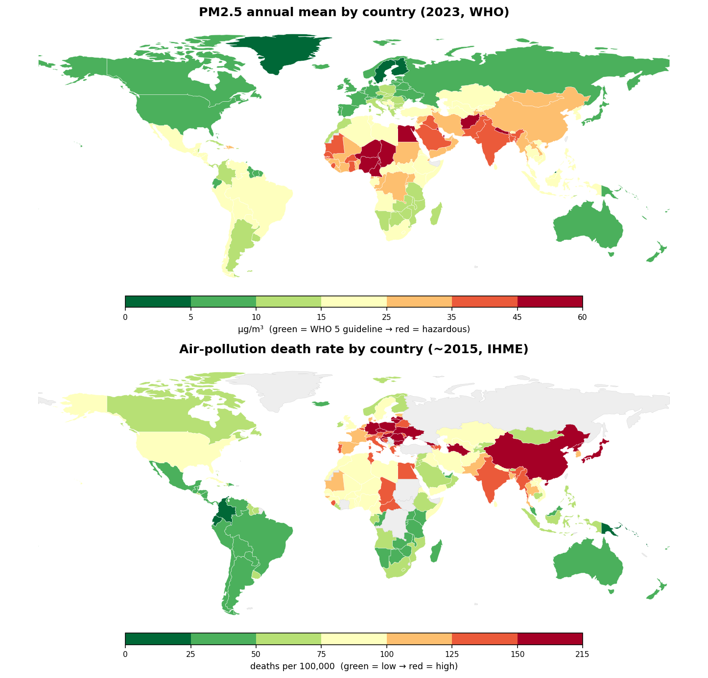
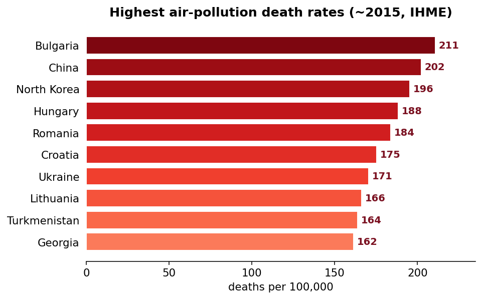

# Global Environmental Intelligence

**Air Quality × Population × Health Impact × Economics**
7 datasets · 228 countries · 1990–2026 · OpenAQ · WHO GHO · IHME GBD · World Bank · Open-Meteo

[Kaggle dataset](https://www.kaggle.com/datasets/sheroleg/global-environmental-intelligence-dataset) ·
[Kaggle notebook](https://www.kaggle.com/code/sheroleg/global-environmental-intelligence-data-analysis/notebook) ·
[Tableau Public](https://public.tableau.com/app/profile/oleg.sher3572/viz/naya_project/Dashboard2)

---

## 1. The four pillars — and how they actually join

| Pillar | Source | Grain | Coverage |
|---|---|---|---|
| Air Quality (measured) | OpenAQ | station/day, country/month | 8 focus countries, Dec 2024–May 2026 |
| Air Quality (modeled) | WHO GHO `SDGPM25` | country/year | 227 countries, 2010–2023 |
| Health Impact | IHME GBD | country/year | 183 countries, 1990–2017 |
| Economics + Population | World Bank | **region / income group** | 38 aggregates, 2009–2024 |

> **Key data-quality finding.** The World Bank extract contains **only regional and income-group aggregates (Sub-Saharan Africa, OECD, Arab World, …) — zero individual countries.** Economics and Population therefore join at **region grain**; Air Quality and Health join at **country grain**. This analysis keeps the two levels separate rather than forcing an invalid country merge.
>
> A second issue: the WHO `AIR_10/11/12` mortality columns are internally inconsistent (values do not match their per-100k labels), so health-impact metrics are taken from **IHME GBD**, which is clean and well-documented. WHO is used only for its reliable modeled PM2.5 series.

---

## 2. Findings

**Q1 — Who breathes the worst air now (measured)?** India **78 µg/m³** and Pakistan **75** sit ~15× the WHO annual guideline (5 µg/m³). Only the US (9.8) and Israel (12) are near it.

**Q2 — Is it global?** **97.8%** of 227 countries exceed the WHO guideline in 2023. The most exposed (Qatar, Nigeria, Egypt, Cameroon) run **10–12×** over.

**Global picture (green → red).** Top map = measured PM2.5 concentration (2023); bottom = air-pollution death rate (~2015). They don't fully overlap: the Gulf and Sahel are dirtiest by concentration, while Eastern Europe and East Asia carry the highest death *rates* (older populations, disease mix).

**Q3 — Improving?** China **−47%** (2010→2023), Israel −30%, Pakistan −32%, India −26%. But South Asia stays ~43 µg/m³, and the US edged **+6%** (wildfire smoke).

**Q4 — Dirtier air → bigger toll?** Correlation of PM2.5 with the *share* of deaths from outdoor AP is weak (**r = 0.27**, n=179) — because in rich countries other causes dominate the death mix. Absolute burden is the honest metric.

**Q5 — Where is the human cost highest?** Death rates: Bulgaria 211, China 202, North Korea 196 per 100k (~2015). Absolute deaths: **China 1.11 M, India 1.09 M** per year from ambient PM2.5.

**Q6 — Economics.** GDP per capita vs PM2.5 (region level, 2019) is **strongly negative, r = −0.70** — the environmental-Kuznets pattern: wealth funds enforcement and cleaner energy.

---

## 3. Why PM2.5 happens — and why it rose

PM2.5 = particles ≤2.5 µm, small enough to cross from lungs into the bloodstream (hence the heart/lung disease burden). Main sources:

| Source | What it is |
|---|---|
| **Fossil-fuel combustion** | Coal power, industry, road transport — **~41% of all air-pollution deaths globally** (IHME 2015) |
| Household solid fuels | Wood/dung/coal cooking & heating — the indoor share that also leaks outdoors |
| Open burning | Crop-stubble burning, waste fires, wildfires (the driver behind the US uptick) |
| Dust & secondary particles | Construction/road dust + particles formed from SO₂, NOₓ, farm ammonia |

South Asia climbed and stayed high because rapid industrialization, a coal-heavy grid, surging vehicle fleets and seasonal stubble burning outpaced emission controls — the same force behind the **−0.70 wealth↔PM2.5** link: pollution rises during build-out, then falls once income funds cleaner energy and enforcement.

## 4. How to lower it — what the data says works

1. **Clean the grid** — coal → renewables/gas; this produced **China's −47%** in 13 years.
2. **Decarbonize transport** — emission/fuel-quality standards, electrified fleets.
3. **Control industry** — scrubbers, filters, and enforcement of existing limits.
4. **Swap household fuels** — LPG/electric cooking cuts the indoor share and outdoor leakage.
5. **End open burning** — stubble-management incentives; agricultural ammonia controls.
6. **Measure & coordinate** — dense monitoring (OpenAQ) and cross-border airshed cooperation.

The trend is **bendable, not fixed** — but because the dirtiest countries are least able to finance the switch, cleaning South Asia's ~43 µg/m³ air is as much a **financing question** as a technical one.

---

## 5. Investment scenario simulator (`scenario_dashboard.html`)

An interactive what-if tool. Pick a country's **real baseline** (WHO 2023 PM2.5, IHME death counts), then drag four levers — **solar / grid decarbonization, EV adoption, clean household fuels, stop open burning** — to project PM2.5 over 10 years with cost and lives-saved estimates. Standalone HTML, no dependencies; hostable on GitHub Pages.

Worked example — **India, all four levers fully deployed:** PM2.5 **42.5 → 22.4 µg/m³ (−47%)**, illustrative cost **~$180 B**, **~3.2 M** cumulative deaths averted over 10 years.

> **Honest ceiling:** even maxing all four levers leaves India at ~22 µg/m³ — **still 4× the WHO guideline** — because industry and background (dust / transboundary) PM2.5 are untouched by them. Reaching WHO 5 needs industrial controls and regional cooperation on top.
>
> **What's real vs assumed:** baselines come from the data; the **sector split and cost intensities are transparent, editable parameters** — the project data contains no source-apportionment or cost figures, so this is a reasoning tool, not a forecast.

---

## 6. Takeaways
1. **Exposure is near-universal** — 98% of countries breach the WHO guideline.
2. **The trend is bendable** — China's −47% proves concentrated policy works.
3. **It tracks development** — clean air and wealth move together (r = −0.70); the burden falls on regions least able to absorb it.

---

## 7. Repository data products (`/outputs`)
| File | Purpose |
|---|---|
| `tableau_master_long.csv` | **Primary Tableau source** — tidy: country, year, metric, value, pillar, source, unit |
| `fact_country_year.csv` | Wide country×year fact (PM2.5 + health) |
| `fact_region_year.csv` | World Bank economics/population by region |
| `fact_city_measured.csv` | OpenAQ latest measured PM2.5 per station (map layer) |
| `fact_openaq_monthly.csv` | Monthly measured PM2.5/PM10 by country |
| `dim_country.csv` | Country dimension (ISO3, name, continent) |
| `presentation.html` | 12-slide findings deck (self-contained) |
| `scenario_dashboard.html` | Interactive PM2.5 investment simulator |
| `TABLEAU_GUIDE.md` | How to build the 3-sheet Tableau dashboard |

See `build_pipeline.py` to regenerate everything from the seven raw CSVs.
