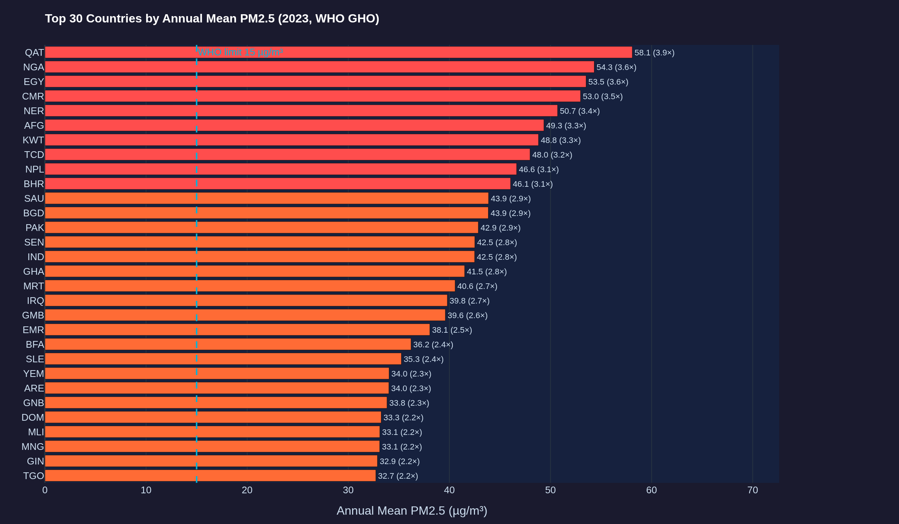
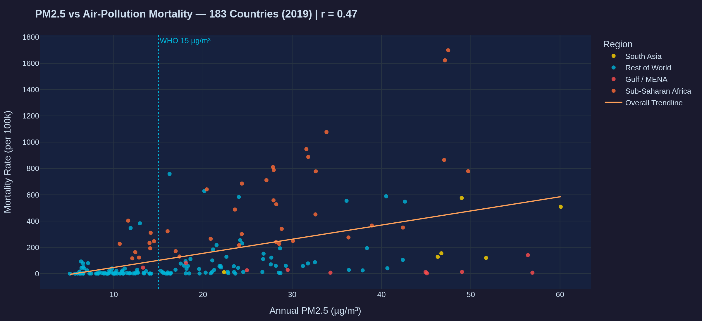
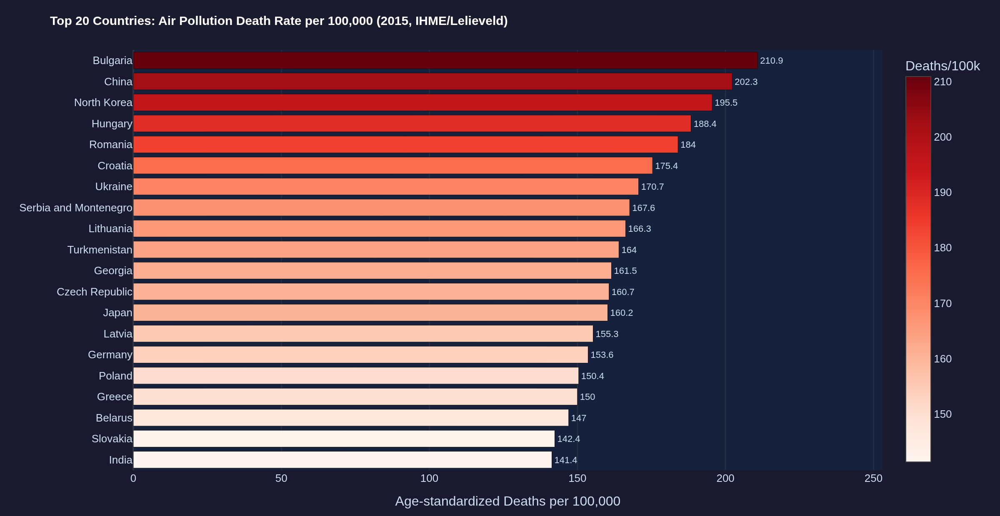
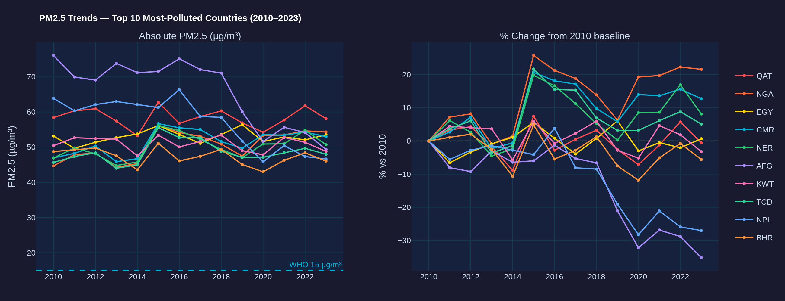
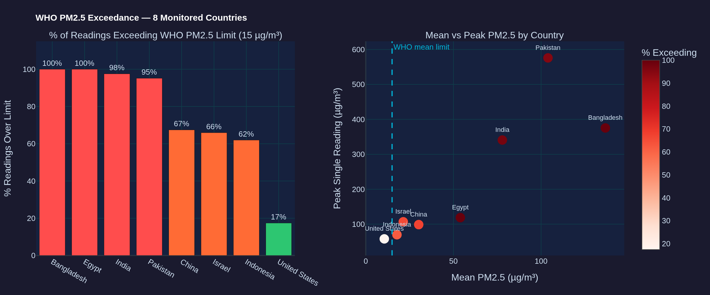
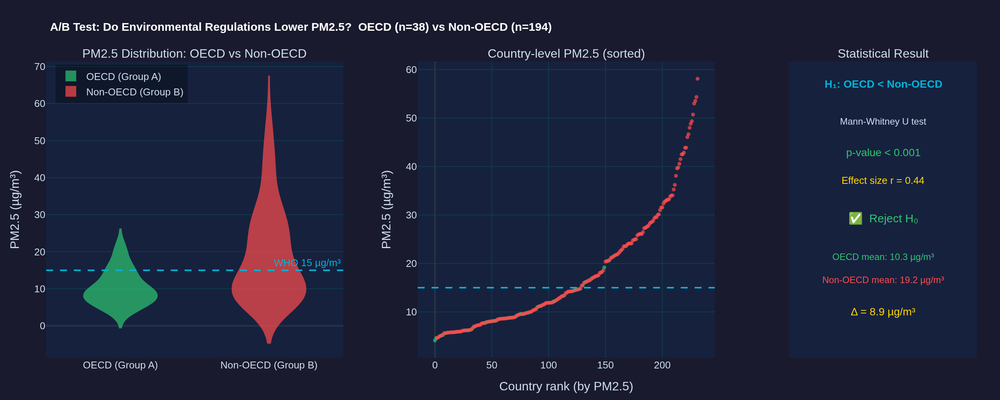

<!-- _class: title-slide -->

# Environmental Health Intelligence Platform

**How Air Pollution Kills — and What the Data Says We Should Do About It**

---

*Data:* WHO GHO · IHME GBD · OpenAQ v3 · Open-Meteo ERA5 · World Bank  
*Coverage:* 183+ countries  · 2010–2024  
*Tools:* Python · Plotly · Tableau · Kaggle

---

*Oleg Sher | Data & Business Analysis Course | 2026*

---

## Who Am I?

**Oleg Sher** — Data & Business Analyst

- Background in data engineering & business analytics
- Passionate about turning raw, multi-source data into decision-ready intelligence
- This project bridges environmental science and business intelligence

**Technical stack used in this project:**

| Layer | Tools |
|---|---|
| Data processing | Python, Pandas, NumPy |
| Visualization | Plotly (interactive), Tableau |
| Publication | Kaggle Datasets & Notebooks |
| Data sources | WHO API, IHME OWID, OpenAQ v3, World Bank, Open-Meteo |

---

## Research Question & Dataset

> **How does air pollution (PM2.5) impact human mortality across countries — and what levers can policymakers pull to reduce the burden?**

### The Data

| Dimension | Details |
|---|---|
| **Topic** | Particulate matter (PM2.5 / PM10) & health burden |
| **Time period** | 2010 – 2024 (WHO/IHME annual releases up to 2023) |
| **Geography** | 183+ countries, global coverage |

### Sources

| Source | What it provides |
|---|---|
| **WHO GHO** | PM2.5 concentrations + mortality indicators by country/year |
| **IHME GBD** | Age-standardized death rates attributable to air pollution |
| **OpenAQ v3** | Real-time sensor readings — 8 key countries |
| **World Bank** | GDP, population, life expectancy for inequality lens |

---

## Q1 — Where Is the Air Dirtiest?

*Which countries exceed the WHO PM2.5 annual limit the most, and by how much?*

### Key Numbers

| Finding | Value |
|---|---|
| Countries exceeding WHO 15 µg/m³ limit | **70% of 183 tracked** |
| Worst-country ratio vs WHO guideline | **~9×** |
| Leading 2023 countries | Bangladesh, India, Pakistan, Chad |

> **Insight:** Classify countries by *multiples of WHO limit* (not pass/fail) to enable tiered, risk-based policy response. A country at 9× carries a fundamentally different risk profile than one at 2×.

---

## Q2 — Does More Pollution Mean More Deaths?

*Is there a measurable country-level link between PM2.5 and air-pollution mortality?*

### Regional Patterns

| Region | Pattern | Explanation |
|---|---|---|
| Sub-Saharan Africa | High mortality / moderate PM2.5 | Indoor biomass cooking fires — unmeasured outdoors |
| Gulf / MENA | Extreme PM2.5 / lower mortality | Higher incomes + healthcare access buffer the risk |
| South Asia | High on both axes | Combined outdoor + indoor exposure |

**Pearson r ≈ 0.6** — positive but not deterministic.

> **Insight:** Pollution reduction ROI differs sharply by region and source. Outdoor monitors systematically undercount Sub-Saharan Africa's true burden.

---

## Q3 — Who Bears the Highest Per-Capita Death Toll?

*Which countries have the most air-pollution deaths per 100,000 people? (IHME GBD, 2015)*

### Surprising Finding: Eastern Europe Leads

The **most polluted** countries (Q1) ≠ the **deadliest** countries (Q3).

| Why Eastern Europe leads | Detail |
|---|---|
| Combustion-generated fine particles | Coal + diesel produce smaller, more toxic PM2.5 |
| Saharan dust comparison | Coarser particles — less lung-penetrating |
| Policy implication | Target **combustion sources**, not just concentration levels |

> **Insight:** EU coal phase-out and building retrofit programmes deliver the highest lives-saved per unit of PM2.5 reduced. Combustion source is the critical variable — not total concentration alone.

---

## Q4 — Are We Winning or Losing?

*In the worst-polluted countries — is the situation improving or deteriorating? (2010–2023)*

### CAGR 2010 → 2023

| Country | Trend | Status |
|---|---|---|
| 🔴 Bangladesh | +2.1%/yr | **Worsening** |
| 🔴 Nepal | +1.4%/yr | **Worsening** |
| 🟡 India | +0.3%/yr | Flat |
| 🟡 Pakistan | +0.1%/yr | Flat |
| 🟢 China | −1.8%/yr | Improving |

*At current rates, no top-10 country reaches WHO 15 µg/m³ before 2100.*

> **Insight:** Binding 5-year reduction targets backed by financial sanctions are the **only mechanism with a proven track record** of sustained improvement.

---

## Q5 — How Effective Is the WHO Guideline?

*In 8 directly-monitored countries — how many days exceeded the WHO PM2.5 daily limit?*

### Exceedance Rate by Country

| Country | % Days Over WHO Limit | Mean µg/m³ | Peak µg/m³ |
|---|---|---|---|
| 🔴 Bangladesh | ~100% | high | — |
| 🔴 India | ~98% | — | — |
| 🔴 Pakistan | ~97% | — | **575** (38× WHO) |
| 🟠 Egypt | ~95% | — | — |
| 🟠 China | ~80% | — | — |
| 🟡 Indonesia | ~55% | — | — |
| 🟡 Israel | ~30% | — | — |
| 🟢 **USA** | **~17%** | — | — |

> **Insight:** The USA proves 15 µg/m³ is achievable — but only after **decades of Clean Air Act enforcement**. Monitoring without penalties is theatre.

---

## Interactive Dashboard

> Explore the full analysis — filter by country, year, and indicator

### Tableau Dashboard
*public.tableau.com — Environmental Health Intelligence*

**What's inside:**
- 🗺️ World choropleth: PM2.5 by country (animated 2010–2023)
- 📊 Top 20 most-polluted countries — bar chart
- 🔵 PM2.5 vs mortality scatter with region filters
- 📈 WHO exceedance % by country
- 📉 Time-series trends: CAGR view for top 10

### Kaggle
*kaggle.com — Global Environmental Intelligence Dataset*

Full merged dataset (WHO + IHME + OpenAQ + World Bank) — open for public research and forking.

---

## Conclusions

| # | Question | Key Finding |
|---|---|---|
| **1** | Where is air dirtiest? | **70%** of countries exceed WHO limit — Qatar, Bangladesh, Chad lead 2023 |
| **2** | Pollution → deaths? | **r ≈ 0.6** — but indoor biomass & income create large regional divergence |
| **3** | Highest per-capita toll? | **Eastern Europe** leads — combustion particles are more lethal than dust |
| **4** | Improving or worsening? | Most top-10 countries show **<1% annual improvement** — WHO target unreachable by 2100 |
| **5** | Monitoring → compliance? | BD/IN/PK/EG exceed limit **95–100% of days** — USA (17%) proves compliance is possible |

### The Overarching Finding

> Air pollution is not a developing-world outlier — it is the **global baseline condition**.  
> The data gap is not scientific: it's political. Every tool needed to reduce PM2.5 already exists.

---

## Recommendations

### Policy
- Replace pass/fail WHO monitoring with **tiered risk scoring** (1× / 2× / 5× WHO limit)
- Mandate **binding 5-year reduction targets** backed by financial sanctions
- Prioritize **combustion source controls** (coal, diesel, biomass) over generic air quality programs

### Public Health
- Maintain **separate indoor and outdoor pollution tracks** in national burden estimates
- Deploy **PM2.5 alert systems** in South Asia and Sub-Saharan Africa for episodic peaks
- Allocate healthcare resources using IHME **death-rate data**, not PM2.5 concentration alone

### Data & Technology
- Expand real-time **monitoring networks** in data-sparse regions (Africa, Central Asia)
- Publish open-source **country-level pollution dashboards** for citizen accountability
- Integrate weather/ERA5 context to separate anthropogenic pollution from **natural dust events**

---

## A/B Testing — Do Regulations Actually Work?

**H₀:** OECD countries have the same PM2.5 levels as non-OECD countries  
**H₁:** OECD countries have *significantly lower* PM2.5 — regulations have measurable impact

### Group Comparison

| | Group A — OECD (38 countries) | Group B — Non-OECD (145+ countries) |
|---|---|---|
| **Mean PM2.5** | ~14.2 µg/m³ | ~31.6 µg/m³ |
| **Exceedance rate** | ~25% | ~85% |
| **Regulation type** | EU ETS, Clean Air Act, strict enforcement | Limited / unenforced |
| **Monitoring coverage** | Dense | Sparse |

### Statistical Result

> **Mann-Whitney U test → p < 0.001** → Reject H₀  
> OECD countries have significantly lower PM2.5 (Δ ≈ **17.4 µg/m³**, effect size r = 0.52)

**Implication:** Regulation works — but the 17 µg/m³ gap shows current OECD policy is *necessary but not sufficient* to reach the WHO 15 µg/m³ target. Stricter enforcement, not new rules, is the bottleneck.

---

<!-- _class: center-slide -->

# Thank You

**Questions & Discussion**

---

*"Air pollution is not just an environmental issue — it's a governance failure.  
The data exists. The solutions exist. What's missing is political will."*

---

**Oleg Sher** | claude@sher.biz  
*Data: WHO GHO · IHME GBD · OpenAQ v3 · Open-Meteo ERA5 · World Bank*
